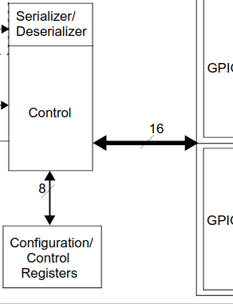
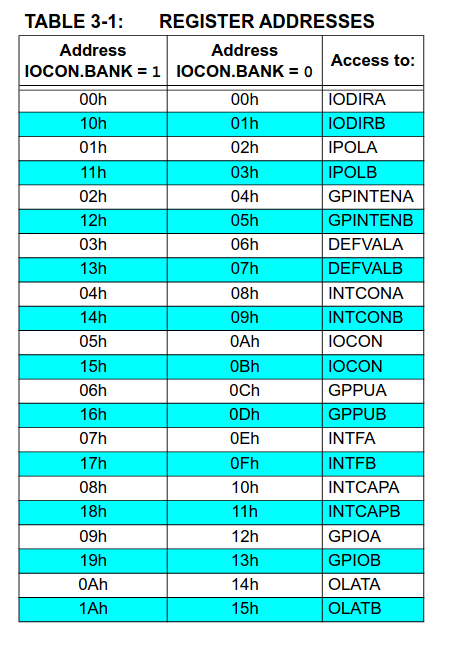
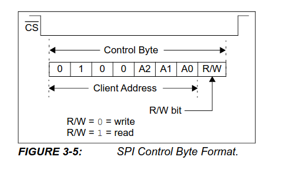

# 2425-TPAutoradio
 TP de Synthèse – Autoradio ESE


## 2 Le GPIO Expander et le VU-Metre

### 2.1 Configuration

écrire sur la broche GPIO pour allumer la LED : (les LEDs sont généralement connectées en logique inversée, donc un 0 allume la LED).


L'hôte du système peut **activer** les E/S en tant qu'**entrées ou sorties** en écrivant les **bits de configuration des E/S ()(IODIRA/B).**

Les **données** de chaque entrée ou sortie sont conservées dans le **registre d'entrée ou de sortie correspondant.**

Les registres de configuration et de contrôle sont sur 8 bits 




Le port d'E/S 16 bits se compose fonctionnellement de **deux ports 8 bits (PORTA et PORTB).**  

Il peut fonctionner en modes 8 bits ou 16 bits via **IOCON.BANK**

Il y a 11 paires de registres  accessibles en tout sur un port (A ou B). Comme on a 2 ports, il y a 22 registres individuels. 

La disposition, l'assignation des adresses des chaque registre varie avec deux plan d'adressage possible. Le choix du plan d'adressage sur lequel le composant va fonctionner est définis par le bit IOCONBANK.

Le bit **BANK** dans le registre IOCON contrôle la disposition des registres internes du microcontrôleur. En modifiant ce bit, vous pouvez changer la manière dont les adresses des registres sont mappées, ce qui affecte la façon dont vous accédez aux différents registres du périphérique.

### Valeurs possibles

- **BANK = 1** : Lorsque ce bit est défini à 1, les registres associés à chaque port (PORTA et PORTB) sont séparés en différentes banques. 
  - Les registres associés à PORTA sont mappés de l'adresse 00h à 0Ah, et les registres associés à PORTB sont mappés de l'adresse 10h à 1Ah.
- **BANK = 0** : Lorsque ce bit est défini à 0, les registres A et B sont appariés. 
  - Par exemple, le registre IODIRA est mappé à l'adresse 00h et le registre IODIRB est mappé à l'adresse suivante, 01h. Les adresses des registres vont de 00h à 15h.

****

Pour l'adressage des 22 registres détaillés voir le tableau ci-dessous



Pour la suite du tp, on partira avers un adressage pour BANK=0

par port (GPA et GPB)

- **MCP23S17_IODIRA** : Adresse du registre de direction  des ports GPIOA (0x00). Ce registre détermine si les broches GPIOA sont  des entrées ou des sorties.
- **MCP23S17_IODIRB** : Adresse du registre de direction  des ports GPIOB (0x01). Ce registre détermine si les broches GPIOB sont  des entrées ou des sorties.
- **MCP23S17_OLATA** : Adresse du registre de sortie  latch pour le port GPIOA (0x14). Écrire dans ce registre met à jour  l'état des sorties sur le port GPIOA.
- **MCP23S17_OLATB** : Adresse du registre de sortie  latch pour le port GPIOB (0x15). Écrire dans ce registre met à jour  l'état des sorties sur le port GPIOB.

On veut configurer en output tous nos gpio car on veut allumer les leds : le registre à manipuler est **IODIRA** et **IODIRB**

Pour écrire et lire les registres en SPI il faut former un octet appelé CONTROL BYTE qui est constituer des champs suivants d'après la documentation :



-un champ de 4 bits qui contient le mot binaire '`0100`' 

-un champ de 3 bits qui contient les bits A2 A1 A0 en l'occurence '`000`' comme ces pins sont connects à la masse.

-un champs de 1 bits qui contient définit la transmission comme une lecture ou une écriture

Voici le control byte formé : 

```c
#define MCP_CONTROL_BYTE(adress, RW)\
		((0b0100 << 4) | (adress & 0b111 << 1) | RW)
```

**Préfixe (`0b0100 << 4`)** :

- `0b0100` est un préfixe spécifique au composant MCP23S17 
- `<< 4` déplace ce préfixe de 4 bits vers la gauche, ce qui donne `0b01000000`.
- Cela correspond au préfixe de l'instruction de lecture/écriture pour le MCP23S17.

**Adresse Matérielle (`(address & 0b111 << 1)`)** :

- `address` est l'adresse matérielle du MCP23S17, déterminée par les broches A0, A1, et A2.
- `& 0b111` masque l'adresse pour ne garder que les 3 bits de poids faible (les bits les moins significatifs).
- `<< 1` déplace le résultat de 1 bit vers la gauche pour le placer correctement dans le byte de contrôle.


Ensuite, il faut transmettre les 8 bits d'adresse du registre à manipuler.

Peu importe l'opération, lecture ou écriture, il faut mettre à 0 la broche CS.

En fin de transmission il faut remettre à 1 la broche CS.

our écrire et lire les registres en SPI il faut former un octet appelé CONTROL BYTE qui est constituer des champs suivants d'après la documentation :


-un champ de 4 bits qui contient le mot binaire '`0100`' 

-un champ de 3 bits qui contient les bits A2 A1 A0 en l'occurence '`000`' comme ces pins sont connects à la masse.

-un champs de 1 bits qui contient définit la transmission comme une lecture ou une écriture


Voici le control byte formé : 

```c
#define MCP_CONTROL_BYTE(adress, RW)\
    ((0b0100 << 4) | (adress & 0b111 << 1) | RW)
```

**Préfixe (`0b0100 << 4`)** :

- `0b0100` est un préfixe spécifique au composant MCP23S17 
- `<< 4` déplace ce préfixe de 4 bits vers la gauche, ce qui donne `0b01000000`.
- Cela correspond au préfixe de l'instruction de lecture/écriture pour le MCP23S17.

**Adresse Matérielle (`(address & 0b111 << 1)`)** :

- `address` est l'adresse matérielle du MCP23S17, déterminée par les broches A0, A1, et A2.
- `& 0b111` masque l'adresse pour ne garder que les 3 bits de poids faible (les bits les moins significatifs).
- `<< 1` déplace le résultat de 1 bit vers la gauche pour le placer correctement dans le byte de contrôle.


Ensuite, il faut transmettre les 8 bits d'adresse du registre à manipuler.


Peu importe l'opération, lecture ou écriture, il faut mettre à 0 la broche CS.

En fin de transmission il faut remettre à 1 la broche CS.

### 2.2 Tests


### 2.3 Driver


## 3 Le CODEC Audio SGTL5000

### 3.1 Configuration préalables

Pins utilisés pour l’I2C:

- I2C_SCL: PB10
- I2C_SDA: PB11

Ces broches correspondent à l'instance 2 i2c, I2C2 de la nucleo

### 3.2 Configuration du CODEC par l’I2C

### 3.3 Signaux I2S

### 3.4 Génération de signal audio

### 3.5 Bypass numérique


## 4 Visualisation


## 5 Filtre RC

Le circuit RC simple est décrit par l'équation suivante, 

Vin(t) = R * C * dVout(t)/dt + Vout(t)

Vin(t) = X * dVout(t)/dt + Y * Vout(t)

Où :

- X = R * C,
- Y = 1.


Ici, T est la période d’échantillonnage, donnée par `T = 1/fs`, où fs est la fréquence d’échantillonnage.

En remplaçant l'approximation dans l'équation différentielle :

Vin[n] = X * (Vout[n] - Vout[n-1]) / T + Y * Vout[n]

Vout[n] = (T / (X + T)) * Vin[n] + (X / (X + T)) * Vout[n-1]

Vout[n] = A * Vin[n] + B * Vout[n-1]

Avec :

- A = T / (X + T)
- B = X / (X + T)
- D = 1

En remplaçant `R * C` par sa relation avec la fréquence de coupure `fc = 1 / (2 * pi * R * C)` :

R * C = 1 / (2 * pi * fc)

Les coefficients deviennent :

- A = T / (1 / (2 * pi * fc) + T),
- B = (1 / (2 * pi * fc)) / (1 / (2 * pi * fc) + T),
- D = 1.

Avec une fréquence d’échantillonnage `fs = 48 kHz`, la période d’échantillonnage est :

T = 1 / fs = 1 / 48000 ≈ 20.83 microsecondes

Si la fréquence du processeur est `f_CPU`, le nombre de cycles processeurs disponibles par échantillon est donné par :

Cycles disponibles = f_CPU * T

Cycles disponibles = 80 * 10^6 * 20.83 * 10^-6 ≈ 1666 cycles


## 6 Programmation d’un effet audio

