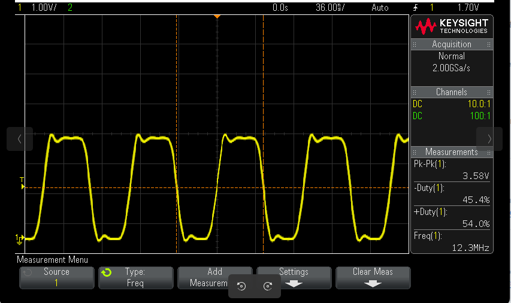
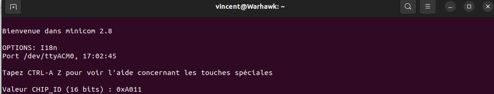

# 2425-TPAutoradio

 TP de Synthèse – Autoradio ESE
 
Vincent LAKME
Karim JERJ


## 2 Le GPIO Expander et le VU-Metre

### 2.1 Configuration

1. Le GPIO Expander utilisé est le MCP23017-E/SO

2. Sur le STM32, le SPI  utilisé est le suivant SPI3 avec SPI3_MOSI sur PB5, SPI3_MISO sur PC11.
3. Les paramètres dans cubeIDE pour la communication SPI sont les suivants : 
   

Nous allons voir comment utiliser ce GPIO Expander.

écrire sur la broche GPIO pour allumer la LED : (les LEDs sont généralement connectées en logique inversée, donc un 0 allume la LED).


L'hôte du système peut **activer** les E/S en tant qu'**entrées ou sorties** en écrivant les **bits de configuration des E/S ()(IODIRA/B).**

Les **données** de chaque entrée ou sortie sont conservées dans le **registre d'entrée ou de sortie correspondant.**

Les registres de configuration et de contrôle sont sur 8 bits 


Le port d'E/S 16 bits se compose fonctionnellement de **deux ports 8 bits (PORTA et PORTB).**  

Il peut fonctionner en modes 8 bits ou 16 bits via **IOCON.BANK**

Il y a 11 paires de registres  accessibles en tout sur un port (A ou B). Comme on a 2 ports, il y a 22 registres individuels. 

La disposition, l'assignation des adresses des chaque registre varie avec deux plan d'adressage possible. Le choix du plan d'adressage sur lequel le composant va fonctionner est définis par le bit IOCONBANK.

Le bit **BANK** dans le registre IOCON contrôle la disposition des registres internes du microcontrôleur. En modifiant ce bit, vous pouvez changer la manière dont les adresses des registres sont mappées, ce qui affecte la façon dont vous accédez aux différents registres du périphérique.

### Valeurs possibles

- **BANK = 1** : Lorsque ce bit est défini à 1, les registres associés à chaque port (PORTA et PORTB) sont séparés en différentes banques. 
  - Les registres associés à PORTA sont mappés de l'adresse 00h à 0Ah, et les registres associés à PORTB sont mappés de l'adresse 10h à 1Ah.
- **BANK = 0** : Lorsque ce bit est défini à 0, les registres A et B sont appariés. 
  - Par exemple, le registre IODIRA est mappé à l'adresse 00h et le registre IODIRB est mappé à l'adresse suivante, 01h. Les adresses des registres vont de 00h à 15h.

****

Pour l'adressage des 22 registres détaillés voir le tableau ci-dessous


Pour la suite du tp, on partira avers un adressage pour BANK=0

par port (GPA et GPB)

- **MCP23S17_IODIRA** : Adresse du registre de direction  des ports GPIOA (0x00). Ce registre détermine si les broches GPIOA sont  des entrées ou des sorties.
- **MCP23S17_IODIRB** : Adresse du registre de direction  des ports GPIOB (0x01). Ce registre détermine si les broches GPIOB sont  des entrées ou des sorties.
- **MCP23S17_OLATA** : Adresse du registre de sortie  latch pour le port GPIOA (0x14). Écrire dans ce registre met à jour  l'état des sorties sur le port GPIOA.
- **MCP23S17_OLATB** : Adresse du registre de sortie  latch pour le port GPIOB (0x15). Écrire dans ce registre met à jour  l'état des sorties sur le port GPIOB.

On veut configurer en output tous nos gpio car on veut allumer les leds : le registre à manipuler est **IODIRA** et **IODIRB**

Pour écrire et lire les registres en SPI il faut former un octet appelé CONTROL BYTE qui est constituer des champs suivants d'après la documentation :


-un champ de 4 bits qui contient le mot binaire '`0100`' 

-un champ de 3 bits qui contient les bits A2 A1 A0 en l'occurence '`000`' comme ces pins sont connects à la masse.

-un champs de 1 bits qui contient définit la transmission comme une lecture ou une écriture

Voici le control byte formé : 

```c
#define MCP_CONTROL_BYTE(adress, RW)\
		((0b0100 << 4) | (adress & 0b111 << 1) | RW)
```

**Préfixe (`0b0100 << 4`)** :

- `0b0100` est un préfixe spécifique au composant MCP23S17 
- `<< 4` déplace ce préfixe de 4 bits vers la gauche, ce qui donne `0b01000000`.
- Cela correspond au préfixe de l'instruction de lecture/écriture pour le MCP23S17.

**Adresse Matérielle (`(address & 0b111 << 1)`)** :

- `address` est l'adresse matérielle du MCP23S17, déterminée par les broches A0, A1, et A2.
- `& 0b111` masque l'adresse pour ne garder que les 3 bits de poids faible (les bits les moins significatifs).
- `<< 1` déplace le résultat de 1 bit vers la gauche pour le placer correctement dans le byte de contrôle.


Ensuite, il faut transmettre les 8 bits d'adresse du registre à manipuler.

Peu importe l'opération, lecture ou écriture, il faut mettre à 0 la broche CS.

En fin de transmission il faut remettre à 1 la broche CS.

our écrire et lire les registres en SPI il faut former un octet appelé CONTROL BYTE qui est constituer des champs suivants d'après la documentation :


-un champ de 4 bits qui contient le mot binaire '`0100`' 

-un champ de 3 bits qui contient les bits A2 A1 A0 en l'occurence '`000`' comme ces pins sont connects à la masse.

-un champs de 1 bits qui contient définit la transmission comme une lecture ou une écriture


Voici le control byte formé : 

```c
#define MCP_CONTROL_BYTE(adress, RW)\
    ((0b0100 << 4) | (adress & 0b111 << 1) | RW)
```

**Préfixe (`0b0100 << 4`)** :

- `0b0100` est un préfixe spécifique au composant MCP23S17 
- `<< 4` déplace ce préfixe de 4 bits vers la gauche, ce qui donne `0b01000000`.
- Cela correspond au préfixe de l'instruction de lecture/écriture pour le MCP23S17.

**Adresse Matérielle (`(address & 0b111 << 1)`)** :

- `address` est l'adresse matérielle du MCP23S17, déterminée par les broches A0, A1, et A2.
- `& 0b111` masque l'adresse pour ne garder que les 3 bits de poids faible (les bits les moins significatifs).
- `<< 1` déplace le résultat de 1 bit vers la gauche pour le placer correctement dans le byte de contrôle.


Ensuite, il faut transmettre les 8 bits d'adresse du registre à manipuler.


Peu importe l'opération, lecture ou écriture, il faut mettre à 0 la broche CS.

En fin de transmission il faut remettre à 1 la broche CS.

### 2.2 Tests


### 2.3 Driver

Nous avons par la suite écrit le driver correspondant drv_MCP.c

```
#include <stdio.h>
#include <stdlib.h>
#include "drv_MCP.h"

#include "spi.h"

typedef struct {
	SPI_HandleTypeDef* hspi;
	uint8_t GPA;	// LED array in GPIOA
	uint8_t GPB;	// LED array in GPIOB
} h_MCP_t;

h_MCP_t hMCP;

void WriteRegister(uint8_t reg, uint8_t data)
{
	uint8_t control_byte = MCP_CONTROL_BYTE(REG_CONTROL_ADDR, VU_WRITE); // Address = 0b000

	uint8_t buffer[2] = {reg, data};
	HAL_StatusTypeDef status;


	//Down chip select to 0
	HAL_GPIO_WritePin(VU_nCS_GPIO_Port, VU_nCS_Pin, GPIO_PIN_RESET);


	// Transmit control byte
	status = HAL_SPI_Transmit(hMCP.hspi, &control_byte, 1, HAL_MAX_DELAY);

	if (status != HAL_OK) {

		HAL_GPIO_WritePin(VU_nCS_GPIO_Port, VU_nCS_Pin, GPIO_PIN_SET); // Deassert chip select
		printf("Error: Failed transmit control byte (status returned %d)\r\n", status);
		Error_Handler(); // Handle the error
		return; // Prevent further execution
	}

	// Transmit register address and data
	status = HAL_SPI_Transmit(hMCP.hspi, buffer, 2, HAL_MAX_DELAY);
	if (status != HAL_OK) {
		HAL_GPIO_WritePin(VU_nCS_GPIO_Port, VU_nCS_Pin, GPIO_PIN_SET); // Deassert chip select
		printf("Error: Failed transmit register data (status returned %d)\r\n", status);
		Error_Handler(); // Handle the error
		return; // Prevent further execution
	}
car la pointe de la branche courante est derrière
astuce: son homologue distant. Intégrez les changements distants (par exemple 'git pull ...

	// UP chip select to 1
	HAL_GPIO_WritePin(VU_nCS_GPIO_Port, VU_nCS_Pin, GPIO_PIN_SET);


}

void Update_LEDs(void){

	WriteRegister(MCP_OLATA, hMCP.GPA);
	WriteRegister(MCP_OLATB, hMCP.GPB);

}
void Set_LED_id(uint8_t led){
	if (led > 7)
	{
		hMCP.GPB = ~(1 << led%8);
		hMCP.GPA = 0xFF; // All LEDs on GPIOA OFF
	}
	else
	{
		hMCP.GPA = ~(1 << led);
		hMCP.GPB = 0xFF; // All LEDs on GPIOB OFF
	}

	Update_LEDs();
}

void Toggle_LED_id(uint8_t led){
	if (led > 7)
	{
		hMCP.GPB = (hMCP.GPB & ~(1 << led%8)) | (~hMCP.GPB & (1 << led%8));
	}
	else
	{
		hMCP.GPA = (hMCP.GPA & ~(1 << led)) | (~hMCP.GPA & (1 << led));
	}

	Update_LEDs();
}
void Set_LEDs(uint16_t leds){

	hMCP.GPB = (0xFF00 & leds) >> 8;
	hMCP.GPA = 0xFF & leds;

	Update_LEDs();
}


void xpdr_Init(void){

	hMCP.hspi = &hspi3;

	HAL_SPI_Init(hMCP.hspi);

	// nRESET to base state
	HAL_GPIO_WritePin(VU_nRESET_GPIO_Port, VU_nRESET_Pin, GPIO_PIN_SET);

	// nCS to reset state
	HAL_GPIO_WritePin(VU_nCS_GPIO_Port, VU_nCS_Pin, GPIO_PIN_SET);

	// Set all GPIOA and GPIOB pins as outputs
	WriteRegister(MCP_IODIRA, MCP_ALL_ON); // GPA as output
	WriteRegister(MCP_IODIRB, MCP_ALL_ON); // GPB as output

	hMCP.GPA = 0xFF;	// All LEDs on GPIOA OFF
	hMCP.GPB = 0xFF;	// All LEDs on GPIOB OFF

	Update_LEDs();

}


void level_R(int level){
	if (level <= 100)
	{
		hMCP.GPA = 0xFF & (0x00FF << (int)(8*level/100));

		MCP_Update_LEDs();
	}
}
void level_L(int level){
	if (level <= 100)
	{
		hMCP.GPB = 0xFF & (0x00FF << (int)(8*level/100));

		MCP_Update_LEDs();
	}
}

```

## 3 Le CODEC Audio SGTL5000

### 3.1 Configurations préalables

Le CODEC utilisant deux protocoles de communication avec l'I2C pour la configuration et l'I2S pour le transfert des échantillons audio, nous allons nous concentrer dans un premier temps sur la partie I2C.

1. Nous utilisons la configuration suivante pour l'I2C :


PB10 et PB11 sont la configuration  de base de l'I2C2.
Une fois la configuration de l'I2C laissée par défaut, on s'attaque à celle de l'I2S.

3. Ce protocole ne se trouve non plus dans connectivity mais dans multimedia. On met le SAI A en Master et SAI B en Synchronous Slave et on utilise le protocole I2S pour ces deux là.
   On active les interruptions pour pouvoir configurer le DMA de SAI A et B avec le mode circulaire.
   On part ensuite activer l'horloge MCLK et on n'oublie pas d'alimenter notre CODEC avec une horloge, sans quoi la communication I2C ne fonctionnera pas.


### 3.2 Configuration du codec par l'I2C

1. Le signal MCL est observé sur la figure suivante à l'oscilloscope 
)

2. On récupère la valeur par l'I2C contenue dans le registre CHIP_ID. C'est bien la bonne valeur attendue.

   )

   

   

5. Le tableau donnant la valeurs à assigné dans les registres est le suivant :

   1. | Nom du Registre    | ADR du registre | Valeur à assigner |
      | ------------------ | --------------- | ----------------- |
      | CHIP_ANA_POWER     | 0x0030 v        | 0x6AFF v          |
      | CHIP_LINREG_CTRL   | 0x0026 v        | 0x006C v          |
      | CHIP_REF_CTRL      | 0x0028 v        | 0x009C v          |
      | CHIP_LINE_OUT_CTRL | 0x002C v        | 0x031E v           |
      | CHIP_SHORT_CTRL    | 0x003C v        | 0x1106 v          |
      | CHIP_ANA_CTRL      | 0x0024 v        | 0x0004 v           |
      | CHIP_DIG_POWER     | 0x0002 v        | 0x0073 v          |
      | CHIP_LINE_OUT_VOL  | 0x002E v        | 0x1111 v           |
      | CHIP_CLK_CTRL      | 0x0004 v        | 0x0004 v           |
      | CHIP_I2S_CTRL      | 0x0006 v        | 0x0130 v           |
      | CHIP_ADCDAC_CTRL   | 0x000E v        | 0x0000 v           |
      | CHIP_DAC_VOL       | 0x0010 v        | 0x3C3C v          |


La documentation nous dit que  l'on doit écrire les valeurs suivantes dans les registres  **CHIP_LINREG_CTRL** et **CHIP_ANA_POWER**

// NOTE: The next modify call is only needed if both VDDA and
// VDDIO are greater than 3.1 V
// Configure the charge pump to use the VDDIO rail (set bit 5 and
bit 6)
Write CHIP_LINREG_CTRL 0x006C


//------------Power up Inputs/Outputs/Digital Blocks---------
// Power up LINEOUT, HP, ADC, DAC
Write CHIP_ANA_POWER **0x6AFF**
// Power up desired digital blocks
// I2S_IN (bit 0), I2S_OUT (bit 1), DAP (bit 4), DAC (bit 5),
// ADC (bit 6) are powered on
Write CHIP_DIG_POWER **0x0073**

On appelle l'init dans le main pour configurer ces registres.


## 5 Filtre RC

Le circuit RC simple est décrit par l'équation suivante, 

Vin(t) = R * C * dVout(t)/dt + Vout(t)

Vin(t) = X * dVout(t)/dt + Y * Vout(t)

Où :

- X = R * C,
- Y = 1.


Ici, T est la période d’échantillonnage, donnée par `T = 1/fs`, où fs est la fréquence d’échantillonnage.

En remplaçant l'approximation dans l'équation différentielle :

Vin[n] = X * (Vout[n] - Vout[n-1]) / T + Y * Vout[n]

Vout[n] = (T / (X + T)) * Vin[n] + (X / (X + T)) * Vout[n-1]

Vout[n] = A * Vin[n] + B * Vout[n-1]

Avec :

- A = T / (X + T)
- B = X / (X + T)
- D = 1

En remplaçant `R * C` par sa relation avec la fréquence de coupure `fc = 1 / (2 * pi * R * C)` :

R * C = 1 / (2 * pi * fc)

Les coefficients deviennent :

- A = T / (1 / (2 * pi * fc) + T),
- B = (1 / (2 * pi * fc)) / (1 / (2 * pi * fc) + T),
- D = 1.

Avec une fréquence d’échantillonnage `fs = 48 kHz`, la période d’échantillonnage est :

T = 1 / fs = 1 / 48000 ≈ 20.83 microsecondes

Si la fréquence du processeur est `f_CPU`, le nombre de cycles processeurs disponibles par échantillon est donné par :

Cycles disponibles = f_CPU * T

Cycles disponibles = 80 * 10^6 * 20.83 * 10^-6 ≈ 1666 cycles


## 6 Programmation d’un effet audio

